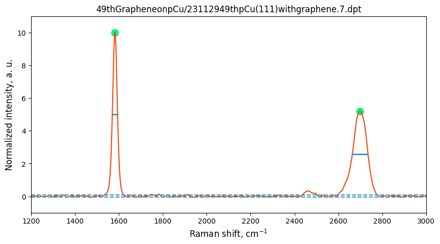
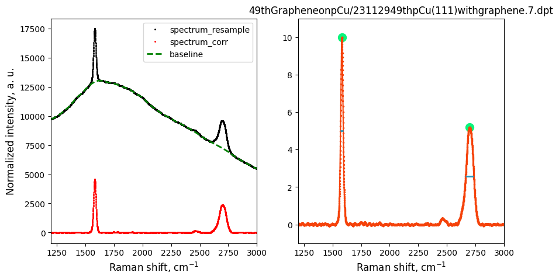
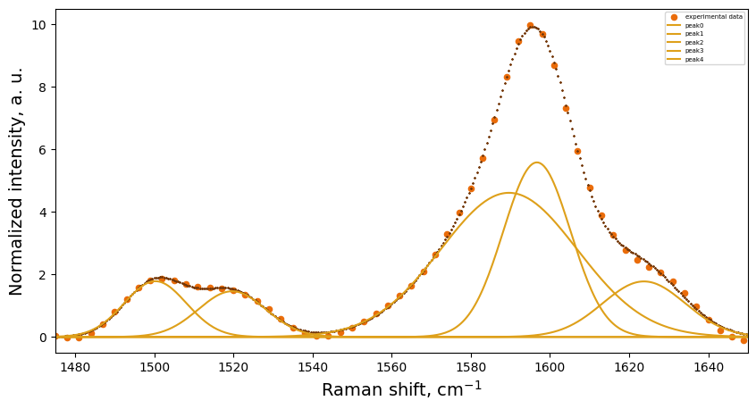

# Automated raman-analyzer 

<div align="center">

</div>

The long-term goal of this script is to automate peak-fitting process of Raman Spectrum.\
The typical procedure to process raman spectrum would include:
- Import the data
- Smooth the line
- Baseline reduction
- Peak and Shoulder Peak finder
- Peak Fitting 

## Dependencies
The script is based on `numpy`,`scipy`,`rampy`,`matplotlib`,`lmfit` to do 
data analysis and visualization.
```bash
pip install rampy
pip install lmfit

# put the following code in your .bashrc
export PYTHONPATH=$PYTHONPATH:/path/to/raman-analyzer
```


## Usage
### Operations on single Raman Spectrum
After running the codes, call: 
```Python
import analyzer as raman
raman = raman.raman_analyzer(name,min,max,filter,noise_min,noise_max)
```
- `name`: your Raman datafile name with full directory (string)
- `min`,`max` : the range of wavenumbers you are interested in analyzing
- `filter`: the filtration threshold for Raman peaks points (the more the filter number is , the less peak points would be stored).
- `noise_min`,`noise_max`: the range of wavenumbers you are interested in analyzing the noise level

- `raman` would be the object in which all the information is stored.

### Batch operation of exporting baseline corrected Raman spectra
```Python
directory = "raman_spectra_folder"
min = 1000
max = 3600
filter = 8
noise_min = 2000
noise_max = 2200
peaks,signals,fwhm,fwhm_test,name,peak_threshold = raman.raman_batch(directory,min,max,filter,noise_test=True,show=True,noise_min,noise_max)
```
- `noise_test`: if True, the script would plot the noise level of each spectrum



- `show`: if True, the script would plot the baseline corrected Raman spectra 
  


Outputs:

- `peaks`: the peak positions of each spectrum
- `signals`: the intensities of peaks of each spectrum
- `fwhm`: the full width at half maximum of each peak
- `name`: the name of each spectrum
- `peak_threshold`: the threshold of peak detection of each spectrum


### Calculation of peak ratios in batch

Peak rations of Raman spectra is a useful tool to analyze graphene and other 2D materials.

```Python
# "total" item is necessary for the calculation of peak ratios.
peak_param = {"d": [1340,1360,'auto'],
              "g": [1500,1750,9],
              "2d":[2500,2900,9],
              "total":[1000,3600,0.1,2000,2200]}
directory = "./raman_spectra"
peak_data, all_peaks = raman.ratio_calculator(directory,ref ='g',**peak_param)
```
- `directory`: the directory of the Raman spectra
- `ref`: the reference peak for the calculation of peak intensity ratios
- `peak_param`: the dictionary of peak parameters.
  - `"total"`: it contains the range of the whole spectrum, the filter number, and the range of noise level.
  - All other items: it contains the range of the peak, and the filter number. if the third value in the list is `"auto"`, the script would find the peak using maximum value in the range.

### Automate peak fitting on single Raman spectrum
```Python
obj_fitting = raman.raman_fitting(name,fit_min,fit_max,kw_fn,\
                                  fit_algo,fit_type,peak_num,\
                                  min,max,filter)
```
- `name`,`min`,`max`,`filter`: those are inherited from `raman_analyzer` class
- `fit_min`,`fit_max`: the range of wavenumbers you are interested in fitting
- `kw_fn`: `**kwargs` containing parameters for fitting algorithm 
- `fit_algo`: the fitting algorithm you want to use. For details, please refer to [lmfit documentation](https://lmfit.github.io/lmfit-py/fitting.html).
- `fit_type`: the type of fitting peaks. It can be `gaussian` or `lorentzian`.
- `peak_num`: the number of fitting peaks.



### Batch operation of exporting peak fitting results
By running the following code, the script would export the fitting parameters of each spectrum in a csv file.

```Python
result = raman.raman_fitting_batch(directory,fit_min,fit_max,peak_num,min,max,export,filter,fit_algo,fit_type)
```
- `export`: if True, the script would export the fitting peak images

## To-do list
- [x] Batch operation of exporting baseline corrected Raman spectra
- [x] Batch operation of exporting peak fitting results
- [ ] CLI usage of the script  
## Author
- Wentong Zhou[@Linkedin](https://www.linkedin.com/in/wentong-zhou-5ab2402a/)
  

## Citation

If you use this code, please cite the following paper:

```
